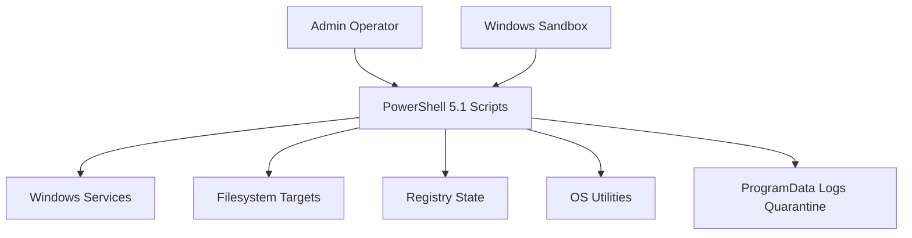

## Assumption validation check-in

- These scripts are intended for internal Windows administration by a trusted operator, not for untrusted end users or internet-exposed callers.
- The primary deployment model is manual local execution in Windows PowerShell 5.1, with optional use through local automation or RMM tooling.
- Direct remote attack surface is assumed to be low because the repo does not implement listeners, APIs, or webhook handlers.
- Data sensitivity is driven more by host integrity and availability than by stored secrets or tenant data.
- High-risk operations are expected to be previewed with `-WhatIf` first and, for riskier flows, validated in Windows Sandbox.

Open questions that would materially change ranking:

- Are any of these scripts pushed automatically to large endpoint fleets or to partially trusted machines?
- Are the retained legacy spool-cleanup variants still used in production, or are they only kept for compatibility/history?
- Do non-admin users ever control staging paths such as `C:\Install\Adobe\` before an admin runs these scripts?

## Executive summary

This repository is a local admin-automation toolkit, not a service. Its main risks come from privileged filesystem, service-control, package-install, and network-reset operations being executed on Windows hosts. The strongest existing controls are `SupportsShouldProcess`, strict mode, trusted-root and reparse-point validation on most destructive flows, signature validation for the Adobe installer path, and optional Windows Sandbox validation for risky scripts. The highest-value manual review target is the printer spool cleanup family, which still deletes from the spool directory without the same path-trust defenses used elsewhere.

## Scope and assumptions

- In scope:
  - `PowerShell Script/Adobe/Install.AdobeAcrobat.Clean.ps1`
  - `PowerShell Script/Printer/*.ps1`
  - `PowerShell Script/windows-maintenance/*.ps1`
  - `PowerShell Script/WindowsServer/FichierOphelin.ps1`
  - `Invoke-WhatIfValidation.ps1`
  - `tests/*`
  - `docs/windows-sandbox-validation.md`
  - `sandbox/sysadmin-main-validation.wsb`
- Out of scope:
  - Windows OS internals
  - Third-party binaries invoked by the scripts (`msiexec.exe`, `netsh.exe`, `ipconfig.exe`, `shutdown.exe`, `Dism.exe`)
  - External package provenance beyond what the scripts validate
- Explicit assumptions:
  - Operators are trusted but can still make mistakes or execute the wrong retained script variant.
  - Attackers are more likely to have local footholds on managed Windows endpoints than direct remote access to these scripts.
  - Repo history is shallow, so ownership-based conclusions are directionally useful but not historically rich.
- Open questions that would materially change ranking:
  - Whether these scripts are fleet-automated or manually invoked.
  - Whether staging folders such as `C:\Install\Adobe\` are tightly controlled.
  - Whether legacy printer scripts remain operationally active.

## System model

### Primary components

- Local operator: launches scripts manually in Windows PowerShell 5.1.
- PowerShell admin scripts: the repo’s main runtime surface under `PowerShell Script/`.
- Windows privileged components: service manager, spooler, Windows Installer, DISM, networking utilities, registry, and filesystem.
- ProgramData-backed output paths: logs and quarantine directories under `C:\ProgramData\sysadmin-main`.
- Validation layer: `Invoke-WhatIfValidation.ps1`, Pester suites in `tests/`, and optional Windows Sandbox validation.

### Data flows and trust boundaries

- Operator -> PowerShell script runtime
  - Data: script invocation, local environment, current user token, current machine state
  - Channel: local CLI execution
  - Security guarantees: no authentication layer inside the repo; trust is delegated to the local Windows session and admin token
  - Validation: `#Requires -Version 5.1`, `Set-StrictMode -Version 3.0`, `SupportsShouldProcess`, selective admin gating
- PowerShell script runtime -> Windows services / OS utilities
  - Data: service names, fixed command arguments, reboot requests, MSI install/uninstall arguments
  - Channel: local PowerShell cmdlets and subprocess execution
  - Security guarantees: local host privilege boundary only; no network auth or rate limiting
  - Validation: some scripts verify executable presence or package signature; others assume fixed `%SystemRoot%`-derived paths
- PowerShell script runtime -> Filesystem targets
  - Data: cache paths, spool paths, installer-store files, ProgramData log/quarantine paths
  - Channel: local filesystem operations
  - Security guarantees: local NTFS permissions
  - Validation: many scripts normalize paths, constrain them to allowed roots, and reject reparse points; the spool-cleanup family is the notable exception
- PowerShell script runtime -> Registry
  - Data: uninstall keys and Windows Installer `LocalPackage` references
  - Channel: local registry reads
  - Security guarantees: HKLM access and Windows access control
  - Validation: registry reads are filtered by explicit roots and then matched against product or package criteria
- Host repo -> Windows Sandbox
  - Data: read-only copy of the repo for disposable validation
  - Channel: Windows Sandbox mapped folder
  - Security guarantees: read-only mapping, networking disabled, vGPU disabled
  - Validation: documented `-WhatIf`-first flow in `docs/windows-sandbox-validation.md`

#### Diagram

## Assets and security objectives

| Asset | Why it matters | Security objective (C/I/A) |
| --- | --- | --- |
| Host OS integrity | Scripts stop services, delete files, move installer artifacts, and reboot the machine | I/A |
| Print spool directory | Wrong deletion target can disrupt printing or remove unintended files | I/A |
| Windows Installer store | Incorrect moves can break repair/uninstall flows and system maintenance | I/A |
| Package staging path for Adobe installer | A tampered package could install or uninstall software under admin context | I |
| ProgramData logs and quarantine output | These artifacts support auditability and rollback of installer-store actions | I/A |
| Validation workflow | `-WhatIf`, Pester, analyzer, and Sandbox checks reduce the chance of unsafe changes landing | I/A |

## Attacker model

### Capabilities

- A local low-privilege user or foothold on the same endpoint attempting to influence admin-run script behavior.
- A compromised or careless operator executing the wrong script variant on a live system.
- A malicious package or staging-file replacement attempt against the Adobe refresh path.
- A malicious filesystem layout that uses reparse points or path redirection where scripts do not explicitly reject them.

### Non-capabilities

- No internet-exposed request handler, listener, or API is present in this repo.
- There is no tenant-to-tenant boundary, session layer, or web auth flow to attack directly.
- Remote attackers without local execution or operator influence do not have a direct entry point into these scripts.

## Entry points and attack surfaces

| Surface | How reached | Trust boundary | Notes | Evidence (repo path / symbol) |
| --- | --- | --- | --- | --- |
| Manual script invocation | Operator launches `.ps1` file | Operator -> script runtime | Main entrypoint for every runtime script | `PowerShell Script/*`, `#Requires -Version 5.1`, `SupportsShouldProcess` |
| Spool cleanup deletion path | Printer cleanup scripts enumerate `%SystemRoot%\\System32\\spool\\PRINTERS` and delete matching files | Script runtime -> filesystem | Older and current variants lack explicit spool-path reparse validation | `PowerShell Script/Printer/Restart.Spool.DeletePrinterQSimple.ps1`, `PowerShell Script/Printer/Restart.spool.delete.printerQ.ps1`, `PowerShell Script/Printer/restart.SpoolDeleteQV4.ps1` |
| Installer-store orphan move | Reads HKLM installer references and moves unmatched `.msi`/`.msp` files | Script runtime -> registry/filesystem | Hardened with trusted roots and reparse checks | `PowerShell Script/windows-maintenance/Move-OrphanedInstallerFiles.ps1`, `PowerShell Script/WindowsServer/FichierOphelin.ps1` |
| Adobe package refresh | Reads uninstall registry keys, validates signature, runs uninstall/install commands | Script runtime -> registry/process/filesystem | Signature and publisher validation are major controls | `PowerShell Script/Adobe/Install.AdobeAcrobat.Clean.ps1`, `Invoke-AdobeAcrobatRefresh` |
| Broad cleanup / network reset | Cache cleanup, DNS flush, service stop/start, reboot, `netsh`, `ipconfig`, `Dism.exe` | Script runtime -> OS utilities/services | Main availability-impacting surface | `PowerShell Script/windows-maintenance/*.ps1` |
| Sandbox validation | Opens repo in disposable read-only Sandbox session | Host repo -> sandbox | Limits blast radius of non-`WhatIf` validation | `docs/windows-sandbox-validation.md`, `sandbox/sysadmin-main-validation.wsb` |

## Top abuse paths

1. Gain a local foothold on a Windows host, influence a spool-cleanup target path or redirection, wait for an admin to run one of the printer queue cleanup variants, and cause unintended file deletion under elevated context.
2. Convince an operator to run `Reset.Network.RebootPC.ps1` or a broad cleanup script on the wrong machine, forcing service interruption, network reset, or reboot on a live endpoint.
3. Replace the staged Adobe package with an untrusted or wrong package and attempt to get an admin to run the refresh script; the expected outcome is a block at signature validation, but any relaxation here would become high impact immediately.
4. Attempt to redirect ProgramData-backed log or quarantine output through a reparse point so a destructive script writes or moves data outside its intended root; current hardened scripts should reject this.
5. Rely on shallow history and single-maintainer ownership so a subtle unsafe admin-script change ships without a second reviewer on a destructive path.

## Threat model table

| Threat ID | Threat source | Prerequisites | Threat action | Impact | Impacted assets | Existing controls (evidence) | Gaps | Recommended mitigations | Detection ideas | Likelihood | Impact severity | Priority |
| --- | --- | --- | --- | --- | --- | --- | --- | --- | --- | --- | --- | --- |
| TM-001 | Local attacker with endpoint foothold or operator running a legacy script variant | Attacker must influence the effective spool target or filesystem layout, and an admin must run one of the spool cleanup scripts | Redirect the spool-cleanup deletion flow so elevated file deletes hit an unintended location | Arbitrary file deletion or print-service disruption on the host | Host OS integrity, print spool directory, availability | Admin gating and `ShouldProcess` are present in all three scripts; extensions are constrained to spool-related files | `Restart.Spool.DeletePrinterQSimple.ps1`, `Restart.spool.delete.printerQ.ps1`, and `restart.SpoolDeleteQV4.ps1` do not validate the spool directory or candidate files with the trusted-root/reparse pattern used elsewhere | Reuse the repo’s `Resolve-SecureDirectory` plus `Test-IsReparsePoint` pattern for spool cleanup before enumeration or delete | Emit structured logs for spool deletions and alert on delete targets outside `%SystemRoot%\\System32\\spool\\PRINTERS` | medium | high | high |
| TM-002 | Careless operator or weak automation targeting | Script is run on a live workstation/server rather than a disposable test target | Execute network reset, service stop/start, reboot, or broad cache cleanup on the wrong machine | Self-inflicted denial of service or operational outage | Host availability, network stack, Windows services | `SupportsShouldProcess`, `-WhatIf`, and Windows Sandbox guidance exist; Sandbox disables networking and mounts the repo read-only | Live-run safety still depends heavily on operator discipline; there is no environment or host allowlist gating | Add optional host-role guards or confirmation metadata for destructive production runs; prefer Sandbox or maintenance windows for non-`WhatIf` testing | Track script execution in central logs and alert on reboot/reset scripts outside maintenance windows | medium | medium | medium |
| TM-003 | Malicious package replacement in the Adobe staging path | Attacker must control the package staging path before an admin executes the script | Attempt to feed the refresh flow a tampered or incorrect installer package | Unauthorized software change or failed refresh attempt | Package staging path, host integrity | `Get-AuthenticodeSignature`, trusted publisher matching, reparse-point rejection on the package path, secure log directory creation | The staging root itself is not explicitly trust-scoped, and publisher matching is broad (`Adobe*`) | Constrain package staging to a trusted root and optionally pin expected product metadata or hash for controlled rollouts | Log signature failures and mismatched publisher/product combinations as security events | low | high | medium |
| TM-004 | Local attacker attempting filesystem redirection | Attacker can create or exploit reparse points in writable areas used for logs or quarantine output | Redirect logs/quarantine writes outside intended roots | Integrity loss of audit/log artifacts or unintended file moves | ProgramData logs, quarantine output, audit trail | Trusted-root validation, reparse-point rejection, and ACL hardening are present in Adobe and installer/quarantine flows | Coverage is strong on these flows already; remaining risk is mostly regression risk | Preserve these patterns and extend equivalent tests anywhere new output roots are added | Keep behavioral Pester tests that assert reparse-point rejection and secure ACL behavior | low | medium | low |
| TM-005 | Process/ownership weakness | Repo continues evolving without a second maintainer or reviewer on destructive paths | Security-relevant changes land without independent review, increasing blind spots and slower recovery | Security regressions persist longer and incident response depends on one maintainer | Validation workflow, all tagged sensitive scripts | Tests, analyzer, docs, and ownership-map artifacts exist | Ownership analysis shows one effective owner and bus factor 1 across all tagged sensitive categories | Add a second reviewer/maintainer, CODEOWNERS, and periodic ownership-map review | Alert when sensitive paths are modified without a second reviewer or when bus factor stays at 1 over time | high | medium | medium |

## Criticality calibration

For this repo and assumed usage:

- `critical` means a repo change or runtime path would let an untrusted actor reliably execute arbitrary code as admin, bypass installer signature checks, or delete/move arbitrary filesystem targets outside intended roots.
  - Example: removing Adobe signature validation from `Install.AdobeAcrobat.Clean.ps1`
  - Example: a destructive cleanup script accepting arbitrary caller-controlled paths without root checks
- `high` means a flaw can cause host-wide integrity loss or broad availability damage from a realistic local or operator-driven path.
  - Example: spool cleanup deleting from a redirected filesystem location under admin context
  - Example: quarantine or installer-store move logic operating outside trusted roots
- `medium` means the issue is bounded by operator action or deployment assumptions but still meaningfully affects destructive admin paths.
  - Example: network reset/reboot or cache cleanup causing outage on the wrong host
  - Example: single-maintainer ownership of all sensitive scripts
- `low` means the issue is constrained by strong existing controls or requires unlikely preconditions.
  - Example: attempted ProgramData output redirection where reparse-point checks already block it
  - Example: information or workflow issues with low direct exploitability

## Focus paths for security review

| Path | Why it matters | Related Threat IDs |
| --- | --- | --- |
| `PowerShell Script/Printer/Restart.Spool.DeletePrinterQSimple.ps1` | Simplest retained spool cleanup variant and the clearest trusted-path gap | TM-001 |
| `PowerShell Script/Printer/Restart.spool.delete.printerQ.ps1` | Legacy spool cleanup variant with the same deletion pattern | TM-001 |
| `PowerShell Script/Printer/restart.SpoolDeleteQV4.ps1` | Hardened logging path but still missing spool-path validation | TM-001 |
| `tests/Printer/Restart.Spool.DeletePrinterQSimple.Tests.ps1` | Current tests only assert `-WhatIf` shape, not path-trust behavior | TM-001, TM-005 |
| `tests/Printer/restart.SpoolDeleteQV4.Tests.ps1` | Good behavior coverage, but no reparse-point negative case on spool targets | TM-001, TM-005 |
| `PowerShell Script/Adobe/Install.AdobeAcrobat.Clean.ps1` | Best current example of signature validation plus secure output-root hardening | TM-003, TM-004 |
| `PowerShell Script/windows-maintenance/Move-OrphanedInstallerFiles.ps1` | Best current example of reparse-aware destructive file handling | TM-004 |
| `PowerShell Script/windows-maintenance/Reset.Network.RebootPC.ps1` | Highest availability-impact surface because it resets networking and reboots the host | TM-002 |
| `docs/windows-sandbox-validation.md` | Key control for reducing blast radius during risky validation | TM-002 |
| `artifacts/security/ownership-map-out/summary.json` | Current evidence for bus-factor and hidden-owner risk across sensitive scripts | TM-005 |

## Quality check

- All discovered runtime entry points were covered: manual script invocation, registry reads, filesystem deletes/moves, subprocess execution, and sandbox validation.
- Each trust boundary appears in at least one abuse path or threat.
- Runtime behavior was separated from tests/docs and validation tooling.
- User clarifications were unavailable, so assumptions and open questions were left explicit.
- Risk ranking is most sensitive to whether the legacy spool-cleanup variants are still operational and whether scripts are fleet-automated.

## Notes on use

- This threat model is intentionally local-admin-centric. If these scripts are ever exposed through fleet automation on partially trusted endpoints, the likelihood for TM-001 and TM-002 should be raised.
- Existing hardened patterns in the installer, cleanup, and Adobe flows are worth reusing rather than reinventing.
